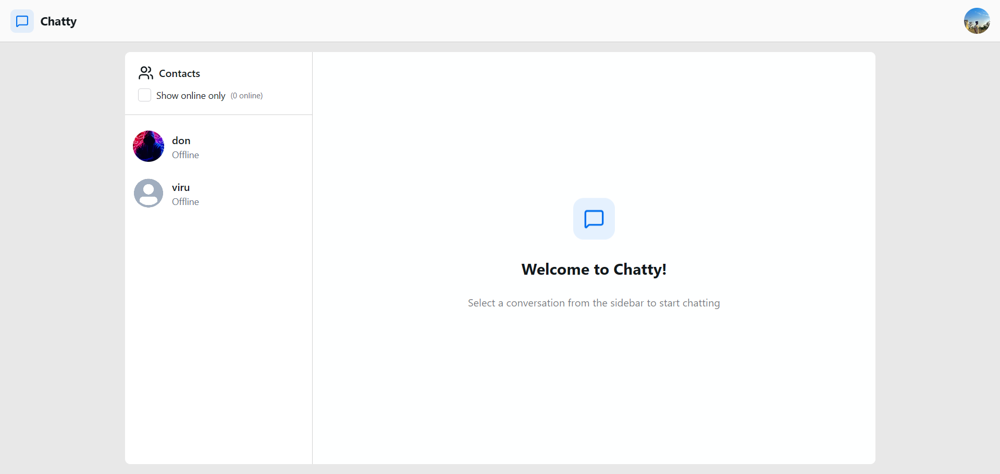
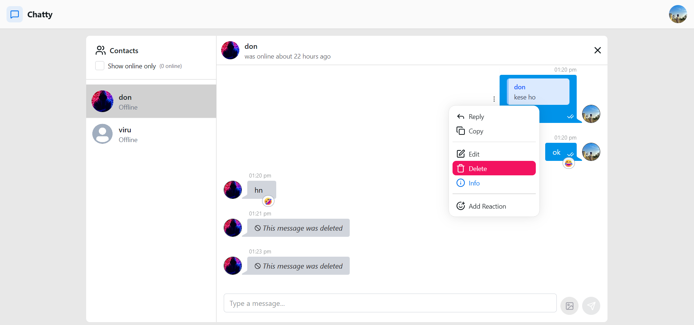
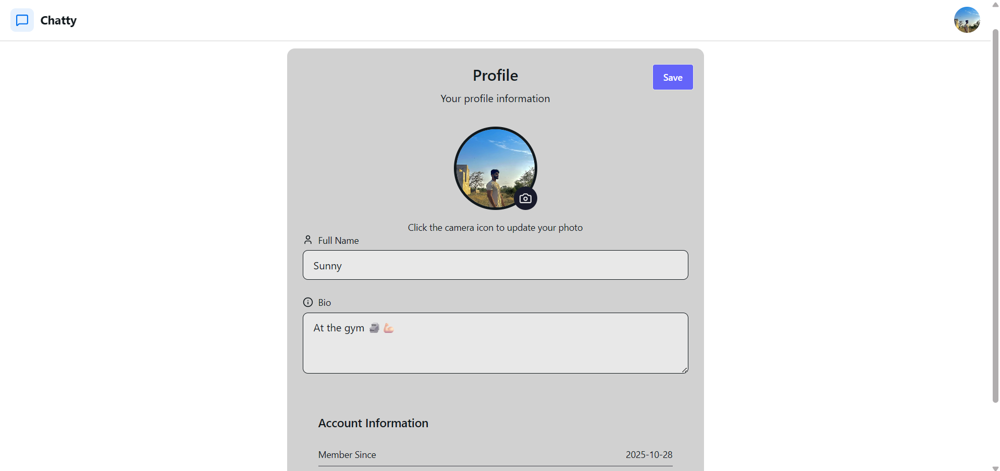
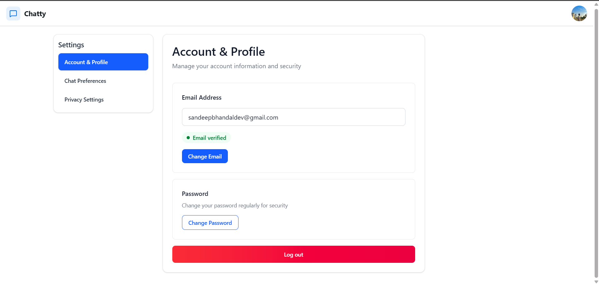
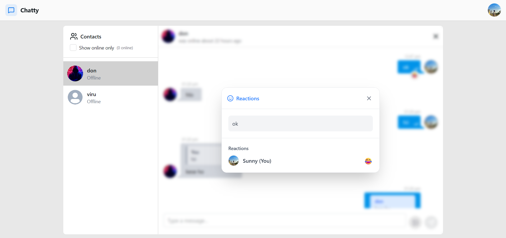

# 💬 Realtime Chat Application

A **full-featured real-time chat app** built with the **MERN stack + Socket.io**.  
Supports personal chats, advanced messaging features, and real-time updates for a smooth communication experience.

---

## 🌐 Live Demo

[💻 View Live Project](https://real-time-chat-app-xi-self.vercel.app/)  

---

## 🚀 Features

### 👤 User Features

- 🔐 **Authentication:** Login / Signup with JWT  
- 👤 **Profile Management:** Update profile details  
- 💬 **Personal Chat:** One-to-one messaging with reply functionality  
- ✏️ **Edit / Delete Messages:** Modify or remove messages  
- ❤️ **Reactions:** Add emoji reactions to messages  
- ⌨️ **Typing Indicators:** See when someone is typing  
- 🟢 **Online / Offline Status:** Check user presence in real-time  
- 📩 **Unread Messages:** Track unread messages  

---

## ⚡ Performance Improvements

**Problem:**  
Loading large chat history caused noticeable UI lag (~350ms locally). Fetching all messages at once was inefficient, especially for users with thousands of messages.

---

**Approach Considered:**  

1. **Skip & Limit Pagination (Implemented)**  
   - **How it works:**  
     ```js
     db.messages.find(...).skip(n).limit(pageSize)
     ```  
   - **Pros:**  
     - Simple and easy to implement  
     - Works well for small to medium datasets  
   - **Cons / Trade-offs:**  
     - Slower for very large datasets (older messages)  
     - Not ideal for extremely long chat histories  

2. **Cursor-Based Pagination (Alternative, Not Used)**  
   - **How it works:**  
     ```js
     db.messages.find({ _id: { $lt: lastMessageId } }).limit(pageSize)
     ```  
     Tracks the last fetched message in each chunk.  
   - **Pros:**  
     - Efficient for large datasets  
     - Consistent results even if new messages are added  
   - **Cons / Trade-offs:**  
     - Slightly more complex to implement  
     - Frontend needs to track the last fetched message  

---

**Decision:**  
Used **skip & limit pagination** for simplicity. It handles the current dataset sizes efficiently. Cursor-based pagination can be considered later if chat histories grow very large.

---

**Impact / Result:**  
- Latency reduced from **~350ms → <100ms** locally  
- Smooth handling of hundreds of messages without UI lag  
- Simple implementation with minimal frontend changes


---

## 🛠️ Tech Stack

| Layer      | Technologies           |
| ---------- | -------------------- |
| Frontend   | React.js, Tailwind CSS, HeroUI, DaisyUI, PrebuiltUI |
| Backend    | Node.js, Express.js JWT, Zod |
| Websockets | Socket.io |
| Database   | MongoDB               |
| State Management | Context API |

---

## 🔮 Future Improvements

- Group chat functionality 👥  
- File / media sharing 📎  
- Voice Messages 🔊

---

## ⚙️ Installation & Setup

1. Clone the repository:

```bash
git clone https://github.com/sandeep-singh-bhandal/realtime-chat-app.git
cd realtime-chat-app

```

2. Install dependencies

   For backend

   ```bash
   cd backend
   npm install
   ```

   For frontend

   ```bash
   cd frontend
   npm install
   ```

3. Add .env file in the backend and frontend folder

   For Backend

   ```bash
   
   #Port for your backend
   PORT=3000

   #Your JWT Secret Key to encode and decode JWT token
   JWT_SECRET_KEY=your_jwt_secret

   #Production for deployment
   NODE_ENV=development

   #MONGO DB connection string to connect to the database
   MONGODB_URI=your_mongodb_connection_string

   #Cloudinary for image uploads
   CLOUDINARY_CLOUD_NAME=your_cloudinary_name
   CLOUDINARY_API_KEY=your_api_key
   CLOUDINARY_API_SECRET=your_api_secret

   #For Sending Emails
   BREVO_API_KEY=YOUR_BREVO_API_KEY


   ```

   For Frontend

   ```bash
   #Backend Url
   VITE_BACKEND_URL=your_backend_url
   ```

4. Run the project

   Run backend

   ```bash
   cd backend
   npm run dev
   ```

   Run frontend

   ```bash
   cd frontend
   npm run dev
   ```

# Project Screenshots

### 1. Homepage



### 2. Chat Box



### 3. Profile Page



### 4. Settings



### 5. Reactions



### 6. Message Info


